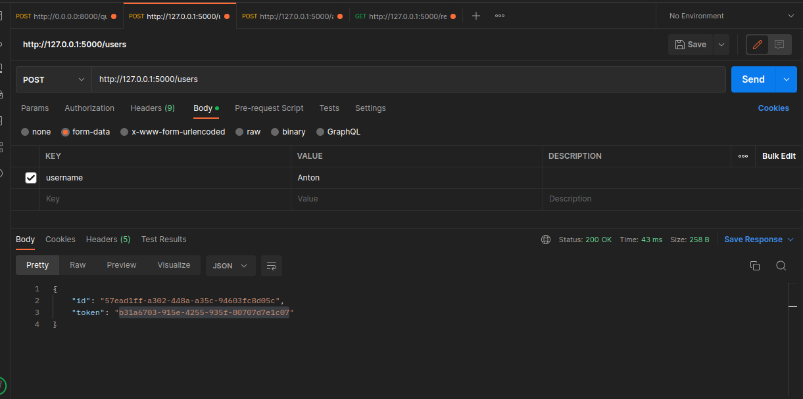
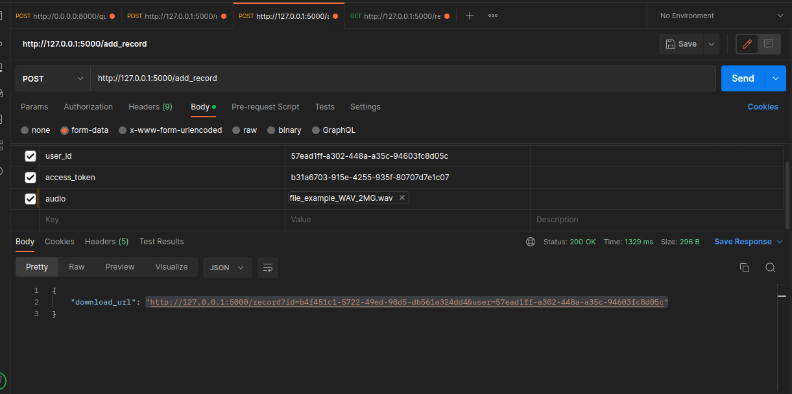
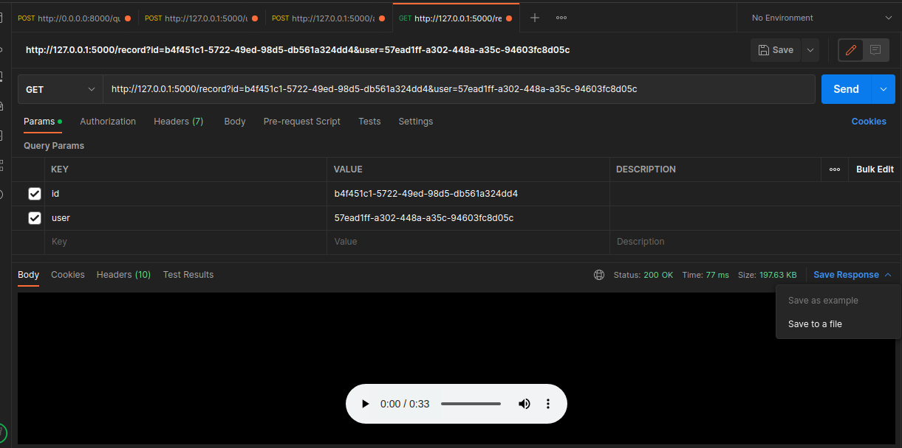

<h1>Инструкция по запуску</h1>
<section>
<ol>
<li>Клонируйте репозиторий: 
<code>git clone https://github.com/CHRNVpy/web_mp3.git</code></li>

<li>Перейдите в папку с клонированным репозиторием.</li>

<li>Создайте пустую папку audio(для временных файлов): 
<code>mkdir audio</code></li>

<li>Создайте docker контейнер: 
<code>docker-compose up</code></li>

<li>Запустите docker image через Docker desktop или командой: 
<code>docker run &lt;название image(образа)&gt;</code></li>
</section>

<strong>Пример запросов к API сервиса c помощью Postman</strong>

<i>Добавить пользователя</i> 

<i>Конвертировать файл</i> 

<i>Скачать файл</i> 

